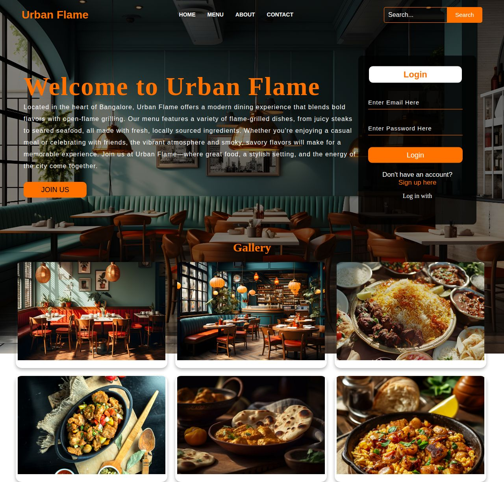
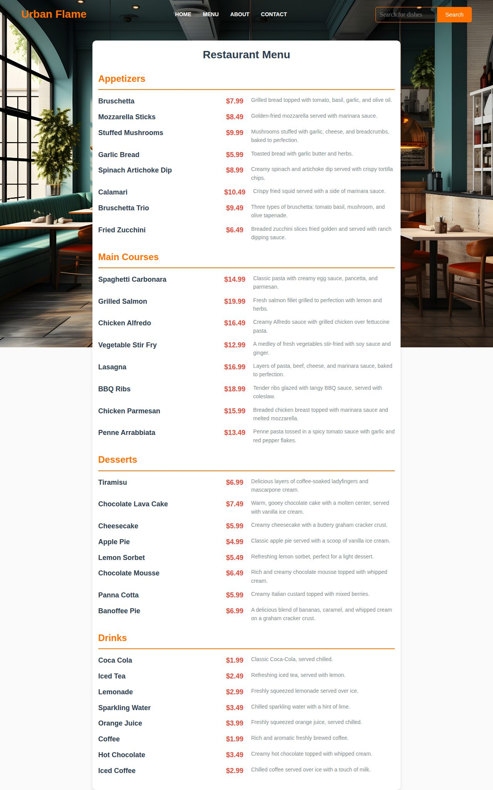
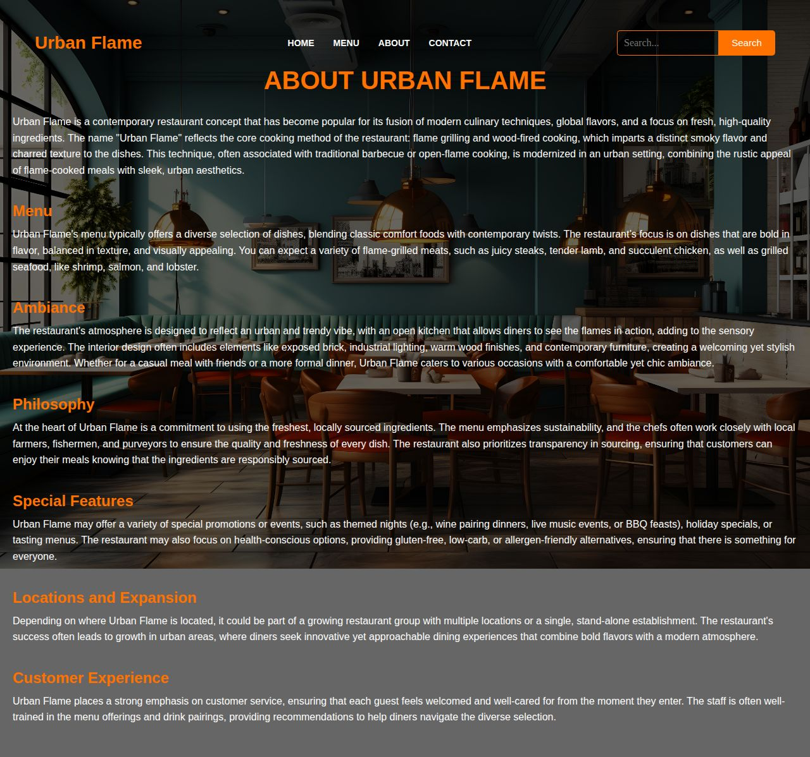
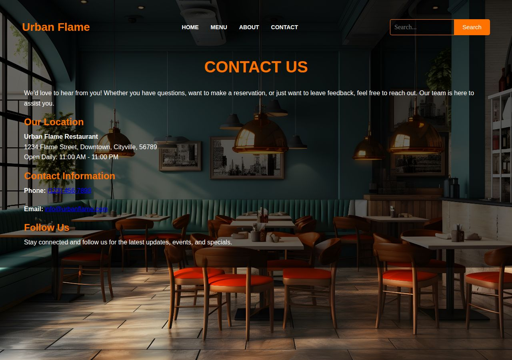
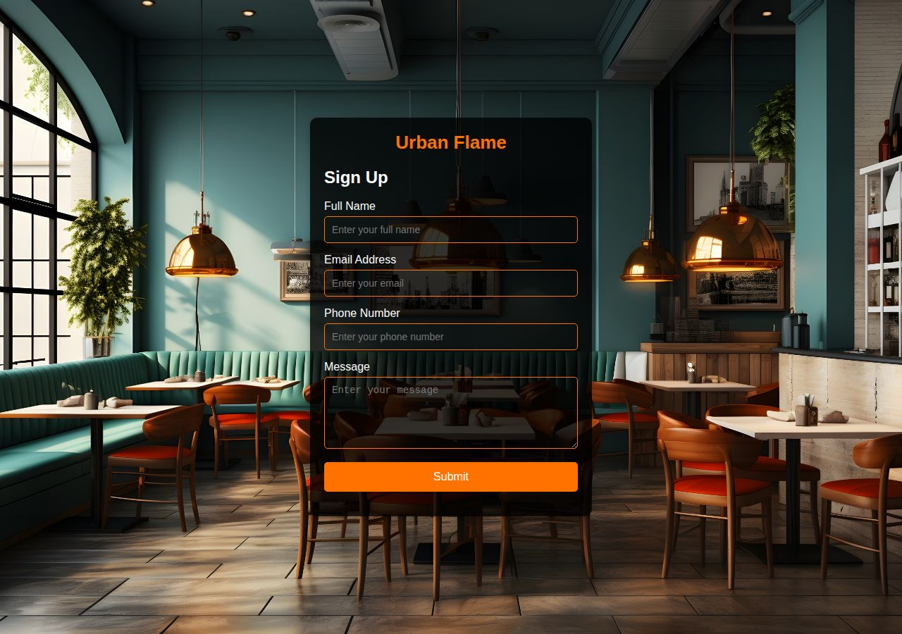

# Urban Flame

A multi-page restaurant website built with plain HTML, CSS, and JavaScript. No frameworks, no backend.

## Features

- Menu page with search — filters dishes by name/description as you type
- Search from any other page redirects to the menu with that term applied
- Sign up form, saves details in the browser (`localStorage`)
- Login form, checks credentials against an account created via sign up
- Layout adapts for smaller screens (navbar, gallery, menu list, and login form re-stack below 900px)

## Screenshots

### Home


### Menu


### About


### Contact


### Sign Up


## Technologies Used

- HTML
- CSS
- JavaScript
- Browser `localStorage`

## Structure

```
Urban-Flame/
├── index.html      Home page (login form)
├── menu.html        Menu, with search
├── aboutus.html      About page
├── contact.html     Contact details
├── signup.html      Sign up form
├── css/              One stylesheet per page
├── js/main.js         Search, login, and signup logic
├── images/           Site images
├── screenshots/      Preview images used in this readme
└── README.md
```

## Running it

Open `index.html` in a browser, or serve the folder locally:

```
cd Urban-Flame
python3 -m http.server 8000
```

Then go to `http://localhost:8000`.

## Limitations

- No backend or database
- Login and sign up only work within the same browser (`localStorage`), not across devices
- Not real authentication — passwords aren't hashed or verified against a server

## Changelog

- **Fixed navbar collision**: the logo, nav links, and search box used fixed-width floated boxes with mismatched pixel math, which made the search bar overlap the nav links (and sometimes the page content below) once real text was measured. Rebuilt the navbar with flexbox across all pages so it sizes correctly at any width, and fixed matching mobile styles.
- **Fixed search redirect**: `menu.html` was referenced with a capital `M` in `js/main.js`, which would 404 on case-sensitive hosting (Linux servers, GitHub Pages, etc.).
