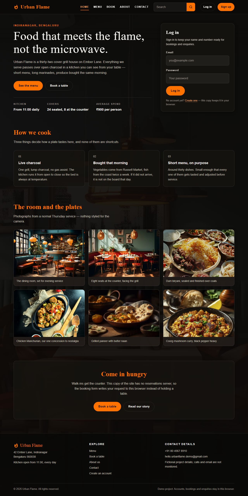
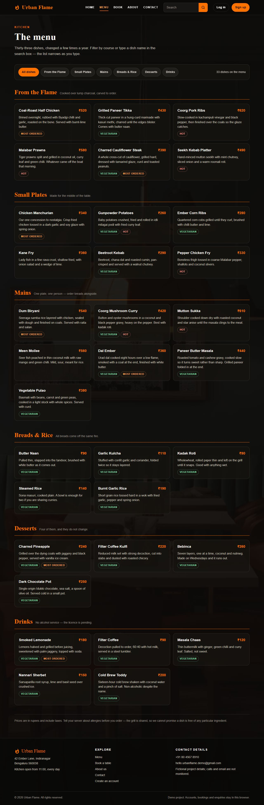
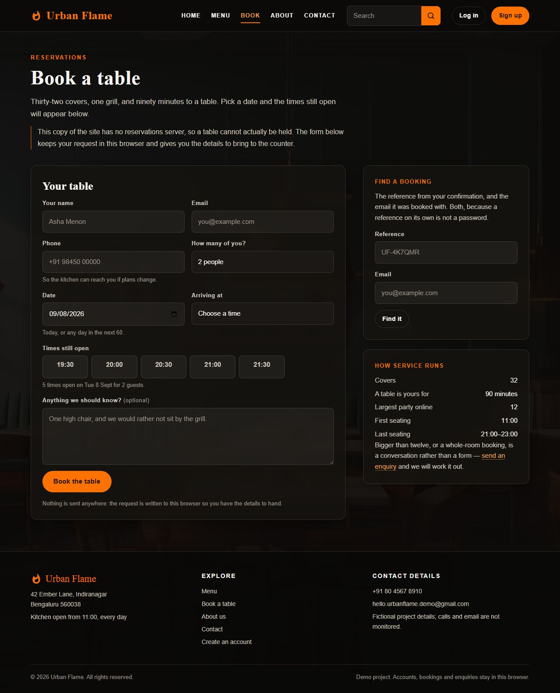
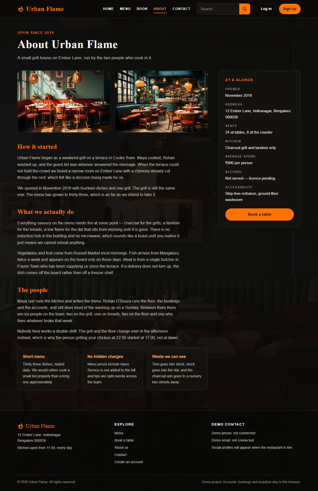
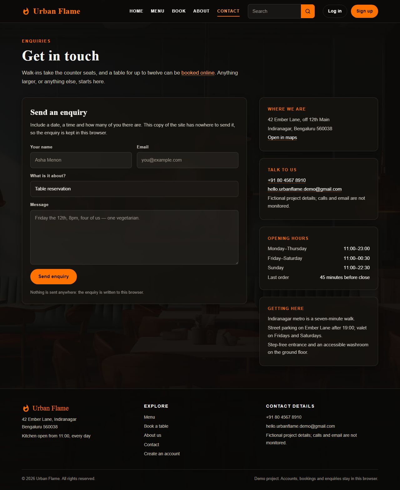
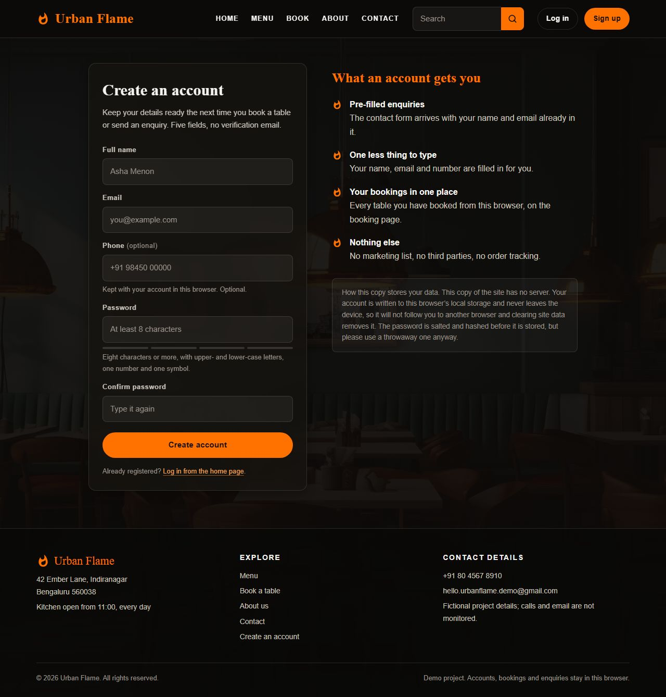

# Urban Flame

[](https://developer.mozilla.org/en-US/docs/Web/HTML)
[](https://developer.mozilla.org/en-US/docs/Web/CSS)
[](https://developer.mozilla.org/en-US/docs/Web/JavaScript)
[](https://nodejs.org/)
[](https://www.postgresql.org/)
[](LICENSE)

## Live Demo

Experience the latest production deployment:

**[Open Urban Flame →](https://urban-flame-sooty.vercel.app/)**

Urban Flame is an eight-page restaurant website for a fictional flame-grill restaurant
in Indiranagar, Bengaluru. It uses hand-written HTML, CSS, and JavaScript. There is no
build step: the `public/` directory is the website that hosts publish.

The project also includes an optional PostgreSQL-backed API for accounts, bookings, and
enquiries. Vercel can run the API and share records through the database. Static hosts
such as GitHub Pages and Netlify publish the frontend only, so those deployments use the
browser's `localStorage` fallback.

The restaurant content and contact details are fictional sample data. The displayed
address is **42 Ember Lane, Indiranagar, Bengaluru 560038**, the phone number is
**+91 80 4567 8910**, and the email is **hello.urbanflame.demo@gmail.com**. They are not
monitored.

## Features

- Responsive layout from 320px upward.
- Restaurant home page, menu, booking, about, contact, account, and staff pages.
- Menu search and course filters that preserve their state in the URL.
- Booking availability based on service hours, party size, and remaining capacity.
- PostgreSQL bookings with slot counters and a database capacity constraint.
- Account creation and login with scrypt on the server and PBKDF2 in local mode.
- Enquiries that staff can view and mark as handled.
- Staff access controlled by the `ADMIN_EMAILS` environment variable.
- Local mode for development without a database.
- Security headers, same-origin checks, rate limiting, secure session cookies, and no
  third-party runtime requests.
- Automated link, markup, contract, API, and responsive-layout checks.

## Choose a running mode

| Mode | Use it when | Data location |
| --- | --- | --- |
| Vercel + PostgreSQL | You need shared accounts, bookings, enquiries, and staff access | PostgreSQL and server sessions |
| Local server + PostgreSQL | You want to develop the full application locally | Your PostgreSQL database |
| Local server without PostgreSQL | You only need to preview or develop the frontend | Browser `localStorage` |
| GitHub Pages or Netlify | You want a static deployment | Browser `localStorage` |

Vercel with PostgreSQL is the recommended deployment mode. The frontend detects the
backend by calling `GET /api/health`. If the database or schema is unavailable, the
frontend uses local mode and changes its messages so it does not claim that data was
stored on the server.

## Pages

All published pages are in `public/`:

| Page | Purpose |
| --- | --- |
| `index.html` | Home page, restaurant introduction, gallery, login, and account summary |
| `menu.html` | Menu with six courses, search, filters, and an empty state |
| `book.html` | Table booking, availability, booking lookup, and cancellation |
| `aboutus.html` | Restaurant story, kitchen information, and capacity details |
| `contact.html` | Enquiry form, sample contact details, opening hours, and directions |
| `signup.html` | Account creation and password-strength feedback |
| `admin.html` | Staff-only view of bookings and enquiries |
| `404.html` | Not-found page |

`admin.html` is intentionally not linked from the public navigation. It is also excluded
from search engines with `robots.txt`, a meta tag, and the `X-Robots-Tag` response header.
The page is not the security boundary: every staff API request checks the signed-in email
against `ADMIN_EMAILS` on the server.

## Screenshots

### Home



### Menu



### Book a table



### About



### Contact



### Sign up



The screenshots are full-page captures at 1280px wide. They are stored in `docs/` and
are not part of the deployed website. Run `npm run screenshots` to regenerate them.

## Requirements

- Node.js 22, 23, or 24.
- npm, included with Node.js.
- A PostgreSQL database only if you want server mode.
- Chrome or Edge for the responsive and screenshot commands.
- Python and Pillow only if you want to regenerate optimized images.

The supported Node.js range is also declared in `package.json` and used by the GitHub
Actions workflow.

## Quick Start

These steps run the complete website locally without requiring a database.

```bash
git clone https://github.com/gunargrithvick/urban-flame.git
cd urban-flame
npm ci
npm start
```

Open <http://localhost:8080> in a browser. The local server serves `public/` and routes
`/api/*` to the same handlers that Vercel uses. Without a database, the API reports that
the database is unavailable and the frontend stores accounts, bookings, and enquiries in
the current browser.

To serve only the static frontend, use this command instead:

```bash
npm run serve
```

Use `npm start` when you want to exercise the API routing. Use `npm run serve` when you
only need a static preview.

## Run with PostgreSQL

1. Create a PostgreSQL database. A hosted provider such as Neon or Supabase works, as
   does a local PostgreSQL installation.

2. Copy the environment template.

   macOS or Linux:

   ```bash
   cp .env.example .env
   ```

   Windows PowerShell:

   ```powershell
   Copy-Item .env.example .env
   ```

3. Open `.env` and replace the example `DATABASE_URL` with your database connection
   string. The project also accepts `POSTGRES_URL`; if both are set, `DATABASE_URL` is
   used first.

4. Apply the schema once:

   ```bash
   npm run db:init
   ```

   The command applies `lib/schema.sql`, checks that all six tables exist, and is safe to
   run again. The API does not apply the schema automatically because several serverless
   functions could otherwise try to create the tables at the same time.

5. Start the application:

   ```bash
   npm start
   ```

6. Check <http://localhost:8080/api/health>. A healthy server-mode response includes:

   ```json
   {
     "ok": true,
     "db": true,
     "schema": true,
     "timezone": "Asia/Kolkata"
   }
   ```

Never commit `.env`. It is ignored by Git. The example file is safe to commit because it
contains only a local example connection string and no real credentials.

## Configure an administrator

`ADMIN_EMAILS` is a comma-separated list of email addresses allowed to use the staff API.
The comparison is case-insensitive. Leave it empty to disable staff access.

For a local database:

1. Add the email to `ADMIN_EMAILS` in `.env`.
2. Restart `npm start`.
3. Create an account with that same email through `signup.html`.
4. Open `admin.html` after signing in.

For Vercel, add `ADMIN_EMAILS` to the Production environment, then redeploy. Create the
account through the deployed sign-up page and open `/admin.html`. Do not put an admin
password in this README, in Git, or in an environment variable. Passwords belong in the
account form and are stored only as hashes.

## Environment variables

All variables are optional. Without a database connection, the site remains usable in
local mode.

| Variable | Required | Description |
| --- | --- | --- |
| `DATABASE_URL` | No | PostgreSQL connection string. Preferred name when configuring the project yourself. |
| `POSTGRES_URL` | No | Accepted alias used by some Vercel database integrations. |
| `ADMIN_EMAILS` | No | Comma-separated staff email addresses. Empty disables staff access. |
| `UF_INSECURE_COOKIES` | No | Set to `1` only for plain HTTP local development. `npm start` sets it automatically when it is unset. Never set it on a deployed site. |

## Deploy to Vercel

Vercel is the recommended host because it can run both `public/` and `api/`.

1. Push the repository to GitHub.
2. Import the repository into Vercel.
3. Keep the framework preset as **Other**. Do not add a build command. `vercel.json`
   already sets `public/` as the output directory.
4. Connect a PostgreSQL provider or add `DATABASE_URL` or `POSTGRES_URL` in Vercel's
   project environment variables. Add it to Production and Preview as appropriate.
5. Add `ADMIN_EMAILS` if staff access is needed.
6. Initialize the production database once by running `npm run db:init` locally with the
   production connection string, or by applying `lib/schema.sql` in your provider's SQL
   editor.
7. Redeploy after changing environment variables. Existing deployments do not use newly
   changed environment values until they are redeployed.
8. Verify these URLs:

   - `/api/health` reports `ok`, `db`, and `schema` as `true`.
   - `/signup.html` can create an account.
   - `/book.html` can read availability.
   - `/admin.html` opens only for an address in `ADMIN_EMAILS`.

Vercel automatically treats files in `api/` as serverless functions. The project currently
has seven API functions. `vercel.json` also configures security headers, cache behavior,
and legacy URL redirects.

## Deploy to Netlify or GitHub Pages

These hosts publish the static frontend only. They do not run the Vercel-shaped functions
in `api/`, so accounts, bookings, and enquiries stay in each visitor's browser.

### Netlify

Connect the repository to Netlify. `netlify.toml` already sets:

- Publish directory: `public`
- A no-op build command
- Redirects for `/about`, `/book`, `/reservations`, and `/register`
- The response headers in `public/_headers`

### GitHub Pages

The workflow in `.github/workflows/deploy.yml` runs `npm ci` and `npm test`, then publishes
`public/`. Enable GitHub Pages with **Source: GitHub Actions**. GitHub Pages cannot run the
API or add response headers, so it is suitable for the static mode only.

### Cloudflare Pages

Set the build output directory to `public/` and leave the build command empty. Cloudflare
Pages can use `public/_headers`, but it cannot run the Vercel functions in `api/`, so this
is also a frontend-only deployment.

## API routes

The file path under `api/` determines the Vercel route.

| Route | Methods | Description |
| --- | --- | --- |
| `/api/health` | `GET`, `HEAD` | Reports backend, database, schema, and restaurant time status |
| `/api/availability?date=` | `GET` | Returns available booking slots and the booking horizon |
| `/api/bookings` | `POST`, `GET`, `DELETE` | Creates, lists, looks up, and cancels bookings |
| `/api/enquiries` | `POST`, `GET`, `PATCH` | Creates enquiries and lets staff list or mark them handled |
| `/api/auth/signup` | `POST` | Creates an account and starts a session |
| `/api/auth/login` | `POST` | Signs in an account |
| `/api/auth/session` | `GET`, `DELETE` | Reads or ends the current session |

API responses use JSON, `Cache-Control: no-store`, and a consistent error shape. Write
requests require the same-origin check. Sessions use `HttpOnly` cookies, and only a
SHA-256 digest of each session token is stored in the database.

## Database tables

`lib/schema.sql` creates six tables:

| Table | Purpose |
| --- | --- |
| `users` | Accounts, names, email addresses, phone numbers, and password hashes |
| `sessions` | Hashed session tokens and expiry times |
| `enquiries` | Contact-form messages and handled status |
| `bookings` | Booking details, references, ownership, and status |
| `slot_load` | Covers reserved for each service slot |
| `rate_limits` | Database-backed rate-limit counters |

Bookings are protected by a database constraint that prevents more than 32 covers from
being reserved. This guarantee does not depend on a single serverless instance's memory.

## Verification commands

Run these commands from the project root.

### Static and contract checks

```bash
npm run check
```

Checks local links, fragments, IDs, labels, images, metadata, CSP-sensitive markup,
redirect targets, API route references, and host configuration consistency. It does not
need a server or a database.

### Full test suite

```bash
npm test
```

Runs `npm run check` and the Node.js test suites. The API tests execute the real handlers
against PGlite, an in-memory PostgreSQL-compatible database, so no external database is
needed for testing.

### Responsive check

Start the site first:

```bash
npm start
npm run responsive
```

The responsive check opens all eight pages at 25 viewport widths, in signed-out and
signed-in states. It checks for horizontal overflow and a desktop header that wraps when
it should switch to the mobile navigation.

### Refresh screenshots

With the site running, and Chrome or Edge installed:

```bash
npm run screenshots
```

### Optimize images

Only run this when replacing the source images:

```bash
npm run images
```

This requires Python and Pillow. It reads the ignored `media/originals/` directory and
regenerates the optimized JPEG and WebP files in `public/assets/img/`.

## Project structure

```text
urban-flame/
├── public/                      Published website
│   ├── *.html                   Eight website pages
│   ├── assets/css/              Shared and page-specific stylesheets
│   ├── assets/js/main.js        Frontend behavior and local fallback
│   ├── assets/img/              Optimized JPEG and WebP images
│   ├── favicon.svg
│   ├── robots.txt
│   ├── _headers                 Netlify and Cloudflare Pages headers
│   └── .nojekyll                GitHub Pages marker
├── api/                         Vercel serverless functions
├── lib/                         Database, validation, sessions, and shared API code
├── test/                        Unit, contract, and API tests
├── tools/                       Local server, database, image, and browser tools
├── docs/screenshots/             README screenshots
├── media/originals/              Ignored source images; never deployed
├── .github/workflows/            GitHub Pages workflow
├── netlify.toml                  Netlify configuration
├── vercel.json                   Vercel configuration
├── .env.example                  Environment variable template
├── package.json                  Scripts and dependency versions
├── package-lock.json              Locked dependency tree
├── LICENSE
└── README.md
```

`public/` is the only directory published as static files. `api/` and `lib/` run on
Vercel, while `tools/`, `test/`, `docs/`, and `media/` stay outside the deployed site.

## Local storage mode

When no working backend is available, the browser uses these keys:

| Key | Storage | Contents |
| --- | --- | --- |
| `uf_accounts` | `localStorage` | Locally hashed accounts |
| `uf_session` | `localStorage` | Current signed-in email |
| `uf_bookings` | `localStorage` | Local booking records |
| `uf_messages` | `localStorage` | Local enquiries, capped at 50 |
| `uf_flash` | `sessionStorage` | One-time redirect message |
| `uf_mode` | `sessionStorage` | Cached backend availability |

Local mode is not authentication. Anyone with browser developer tools can read or change
the data, so use only a throwaway password locally.

## Troubleshooting

### The site does not open

Make sure `npm ci` completed and that `npm start` is still running. Open
<http://localhost:8080>, not a file path.

### Port 8080 is already in use

Choose another port and point browser checks at it.

Windows PowerShell:

```powershell
$env:PORT = 8081
$env:BASE_URL = "http://localhost:8081"
npm start
```

macOS or Linux:

```bash
PORT=8081 BASE_URL=http://localhost:8081 npm start
```

### The API reports that the database is unavailable

Check that `.env` exists, that `DATABASE_URL` or `POSTGRES_URL` is correct, and that the
database accepts connections from your machine. Managed PostgreSQL providers usually
require TLS in the connection string.

### The API reports that the schema is missing

Run `npm run db:init` with the correct database connection, then restart the server.

### The staff page does not open

Confirm that the signed-in email exactly matches an address in `ADMIN_EMAILS`, restart the
local server or redeploy Vercel after changing the variable, and make sure the database
schema has been applied.

### Browser checks cannot find Chrome or Edge

Install one of those browsers or set `CHROME_PATH` to its executable. Set `BASE_URL` if
the site is not running at `http://localhost:8080`.

## Limitations

- The restaurant, menu, prices, hours, address, phone number, and email are fictional.
- No email provider is connected. Bookings and enquiries are stored, but no email is sent.
- Local mode is limited to one browser and is not authentication.
- The staff page is a convenience interface; server-side staff checks protect the data.
- Payments, deposits, no-show handling, and table-by-table floor plans are not included.
- GitHub Pages and Netlify intentionally provide frontend-only mode without the API.

## Author

Guna Rithvick

## License

This project is licensed under the [MIT License](LICENSE).
